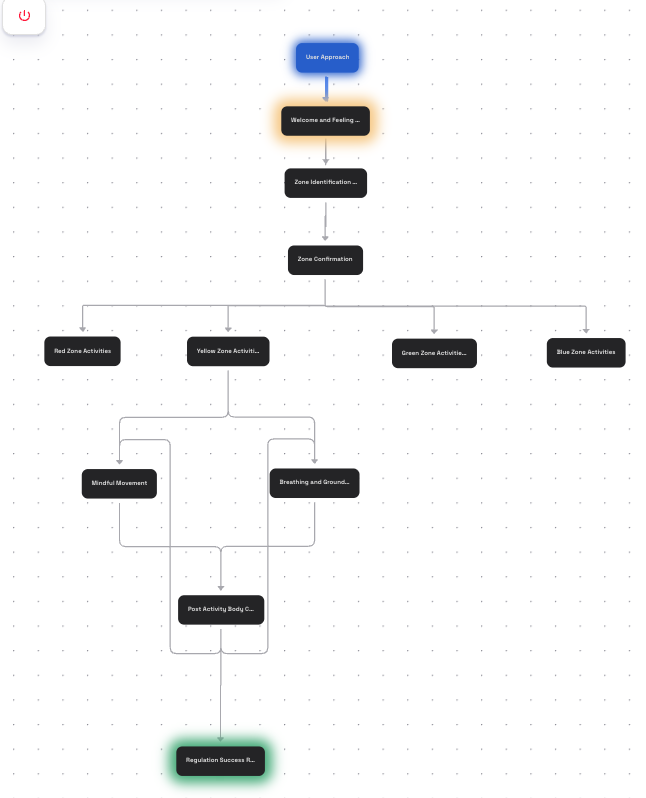
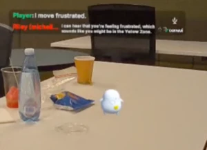
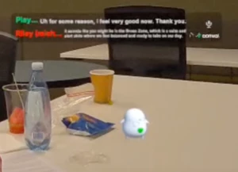

# Winter School on AI for XR

This is a demo project featuring **Riley**, an LLM-powered assistant in augmented reality, designed to support children's emotional wellness. It was created by Team Spot during the Winter School on AI for XR, held from July 14th to 18th, 2025, and organized by Professor Mark Billinghurst at the University of South Australia.

> [!NOTE]
>
> A Meta Quest device is recommended to fully experience the demo, although it is not strictly required. You can alternatively use the Meta XR Simulator via Unity, but please note that the background will be black in the simulator.

## What does Riley do?

Riley is an on-demand emotional wellness companion that helps children identify, understand, and manage their emotions through interactive AR experiences, based on [Zones of Regulation](https://zonesofregulation.com), a psychology-based framework.

Specifically, Riley asks questions about the user's feelings, detects their zone, and provides activities to help regulate their emotions depending on their zone.

## How does Riley work?

Riley is powered by [Convai](https://www.convai.com/) for its flexible conversational abilities and Unity with Meta XR for the AR experience.

To enhance conversational flexibility, we use Convai's Narrative Design feature. This enables Riley to have a more engaging and interactive conversation with the user, and allows the user to explore various topics and emotions. The following diagram shows the actual settings used on the Convai website. (Only the Yellow Zone has been implemented so far.)

Using Convai's Embodied Actions, the color of Riley's heart automatically changes based on the user's zone as follows:

| Yellow Zone                               | Green Zone                              |
| ----------------------------------------- | --------------------------------------- |
|  |  |

## Setting up the demo

1. Get your Convai API Key:
   - Sign up for a free account at [Convai](https://convai.com).
   - Create a new project and get your API Key.
   - Select the key icon in the top right corner of the Convai dashboard, and copy the API Key.
2. Install [Unity](https://unity.com/download)
3. Clone this repository using Git.
4. Add the project in the cloned repository to Unity Hub.
   - Open Unity Hub, click on "Add" → "Add project from disk", then select the cloned repository.
5. Open the project in Unity. (It may take some time to load initially.)
6. In Unity, go to the menu bar → "Convai" → "API Key Setup" to set the Convai API Key you copied earlier.
7. In Unity, go to the Assets panel → open `Scenes/Main` to open the scene.
8. In Unity, select the ▶️ (Play) button on top of the screen, then the Meta XR Simulator will be launched.

Once you see the character in the simulator's black screen, you’re ready to interact with Riley.

> [!WARNING]
>
> - As of now, Riley is randomly spawned in the scene, so if you can't see Riley when launching the demo, try scrolling down or using the WASD keys to move around and find Riley, or restart the demo. (No need to relaunch Unity itself.)
> - If you still can't find Riley, try changing the spawnable area in the Unity scene. [Details](public/how_to_change_spawnable_location.png)
> - If you see a lot of red text on the screen, it may mean:
>     - Your device may not have internet connection.
>     - Your API Key is not set, or your Convai quota is used up.

## Installing the demo on Meta Quest

If you are using Meta Quest, go to the menu bar → "File" → "Build and Run" to build and deploy the project to your Meta Quest device. Make sure your device is connected to your computer via USB and that you have enabled developer mode.

## Playing the demo

1. Ensure your device is connected to the Internet.
2. Approach Riley until you see a floating message dialog around Riley. (This may take time. If you can't see the dialog, try moving around or restarting the demo.)
3. Interact with Riley:
   - For Meta Quest, press the A button on the right controller to start a conversation, or
   - For Meta XR Simulator, press the B key on your keyboard to start a conversation.

## Known Issues

- Riley is randomly spawned on the surface of an arbitrary table.
- Riley model's animations haven't been implemented yet. Currently, we use Convai's default NPC model (Ameria), make it invisible and put the static Riley 3D model which doesn't even include rigging.
- Riley's speech currently uses Convai’s default "Young Female Child" voice. It would be great to switch it to a custom voice using [ElevenLabs integration](https://docs.convai.com/api-docs/plugins-and-integrations/other-integrations/third-party-api-integrations/elevenlabs-api-integration).
- This project has not yet been tested with kids as it's for demo purposes.

## Members of Team Spot

- Manabu Nakazawa ([@mshibanami](https://github.com/mshibanami))
- Michelle Emery ([@MichelleEmery](https://github.com/MichelleEmery))
- Mimi Yoshii-Podger ([@mimistahlbaum](https://github.com/mimistahlbaum))
- Yin Ye ([@2xY-Design](https://github.com/2xY-Design))

## Special Thanks

- [Professor Mark Billinghurst](https://people.unisa.edu.au/Mark.Billinghurst) for organizing the Winter School on AI for XR, which provided the opportunity to learn about AI for XR and to work on this project.
- Tamil Selvan ([@GTamilSelvan07](https://github.com/GTamilSelvan07)) for helping us with Convai and Unity.
- Zirui Xiao ([@FrostyAlien](https://github.com/FrostyAlien)) for helping us with Unity.
